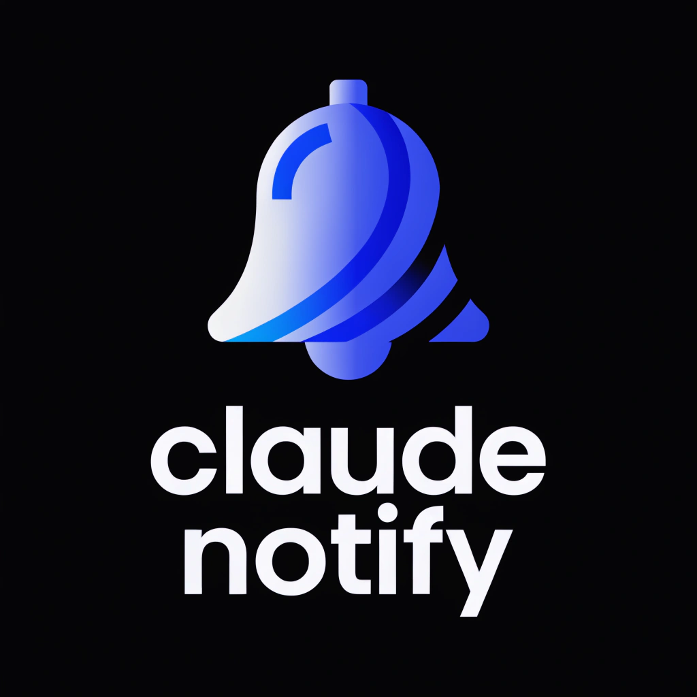

# Claude Notify

Mobile notification system for Claude Code. Get push notifications on your phone when Claude finishes tasks, needs approval for destructive commands, or asks questions — all while you're away from your desk.



## Features

- **Task finish notifications** — Know when Claude completes a task without watching the terminal
- **Destructive command approval** — Approve or deny `rm`, `git push --force`, etc. from your phone
- **Custom text responses** — Send instructions back to Claude when denying a command
- **Live activity feed** — See what Claude is doing in real-time (files edited, commands run, search results)
- **Question replies** — Answer Claude's questions from your phone
- **30-second live feed** — After approving/denying, watch Claude's next actions stream in
- **Smart notifications** — Only fires when you're "Away from desk"; silent when you're at your computer
- **Dark theme UI** — Catppuccin Mocha-inspired dark interface

## Architecture

```
┌─────────────┐     hooks      ┌─────────────┐     FCM      ┌─────────────┐
│ Claude Code │ ──────────────> │  bridge.js  │ ───────────> │ Mobile App  │
│  (terminal) │                │  (Node.js)  │              │  (Flutter)  │
└─────────────┘                └──────┬──────┘              └──────┬──────┘
                                      │                            │
                                      └────── Firestore <─────────┘
```

- **Claude Code hooks** capture tool usage events (Stop, PreToolUse, PostToolUse)
- **bridge.js** writes events to Firestore and sends FCM push notifications
- **Flutter app** listens to Firestore for real-time updates and displays activity
- Notifications only send when user is marked "Away from desk" in the app

## Quick Setup (For Team Members)

### Prerequisites

- Node.js 18+
- Claude Code installed
- Android phone

### 1. Install the mobile app

Download the APK from your team's distribution channel and install it on your phone. Sign in with Google.

### 2. Run the installer

```bash
cd installer
npm install
node setup.js
```

The installer will:
- Ask for your Firebase UID (shown in the app after sign-in)
- Copy hook scripts to `~/.claude/hooks/`
- Install dependencies (firebase-admin, dotenv)
- Configure Claude Code settings

### 3. You're done

- Open the app and toggle "Away from desk" when you leave your computer
- Claude Code will send push notifications for task completions and permission requests
- Open any session in the app to see the live activity feed

## Manual Setup

If you prefer to set things up manually:

### 1. Install hook dependencies

```bash
mkdir -p ~/.claude/hooks
cd ~/.claude/hooks
npm init -y
npm install firebase-admin dotenv
```

### 2. Copy hook files

Copy these files to `~/.claude/hooks/`:
- `bridge.js` — Firebase Admin bridge (FCM + Firestore)
- `stop_hook.sh` — Task finish / question detection
- `pre_tool_use_hook.sh` — Destructive command gating
- `post_tool_use_hook.sh` — Activity tracking
- `notification_hook.sh` — Notification passthrough (disabled)

### 3. Configure environment

Create `~/.claude/hooks/.env`:

```env
FIREBASE_SERVICE_ACCOUNT_PATH=/path/to/serviceAccountKey.json
FIREBASE_PROJECT_ID=your-project-id
CLAUDE_USER_UID=<your-uid-from-the-app>
```

### 4. Update Claude Code settings

Add hooks to `~/.claude/settings.json`:

```json
{
  "hooks": {
    "Stop": [
      {
        "hooks": [
          { "type": "command", "command": "~/.claude/hooks/stop_hook.sh" }
        ]
      }
    ],
    "PreToolUse": [
      {
        "matcher": "Bash",
        "hooks": [
          { "type": "command", "command": "~/.claude/hooks/pre_tool_use_hook.sh" }
        ]
      }
    ],
    "PostToolUse": [
      {
        "hooks": [
          { "type": "command", "command": "~/.claude/hooks/post_tool_use_hook.sh" }
        ]
      }
    ]
  }
}
```

## How It Works

### Notification Flow

| Scenario | At Desk | Away |
|----------|---------|------|
| Task finishes | No notification | Push notification |
| Destructive command (`rm`, `git push --force`) | Auto-allow | Phone approval required |
| Non-destructive command | Auto-allow | Auto-allow |
| Claude asks a question | No notification | Push + reply from phone |
| Progress updates | No notification | Push notification |

### Hook Events

- **Stop** — Fires when Claude finishes responding. Detects if the last message is a question (routes to phone for reply) or a completion (sends finish notification).
- **PreToolUse** — Fires before each tool call. Gates destructive Bash commands through phone approval when away. Auto-allows everything else so Claude keeps working.
- **PostToolUse** — Fires after each tool call. Captures activity (commands run, files edited, search results) as markdown-formatted events in Firestore for the live feed.

### Activity Feed

The PostToolUse hook captures tool usage and writes markdown-formatted events to Firestore:

- **Bash** — Shows the command and output
- **Edit** — Shows the file path and diff
- **Read** — Shows the file path
- **Write** — Shows the file path
- **Glob/Grep** — Shows the search pattern and matches

These appear in the session detail screen as a dark terminal-style timeline.

## Project Structure

```
claude_notify_app/
├── lib/                          # Flutter app source
│   ├── app.dart                  # App root, routing, FCM handling
│   ├── theme.dart                # Dark theme (Catppuccin Mocha)
│   ├── models/
│   │   ├── session.dart
│   │   └── event.dart
│   ├── screens/
│   │   ├── login_screen.dart
│   │   ├── home_screen.dart
│   │   ├── session_detail_screen.dart
│   │   ├── permission_request_screen.dart
│   │   └── question_reply_screen.dart
│   ├── services/
│   │   ├── auth_service.dart
│   │   ├── firestore_service.dart
│   │   └── fcm_service.dart
│   └── widgets/
│       ├── presence_toggle.dart
│       ├── session_card.dart
│       └── event_tile.dart
├── installer/                    # One-click installer
│   ├── setup.js
│   ├── hooks/
│   └── package.json
├── android/
├── ios/
└── assets/
    └── app_icon.png
```

## Firebase Setup (Admin Only)

If you're setting up a new Firebase project:

1. Create a Firebase project at [console.firebase.google.com](https://console.firebase.google.com)
2. Enable **Authentication** (Google sign-in provider)
3. Enable **Cloud Firestore**
4. Enable **Cloud Messaging**
5. Add an Android app and download `google-services.json`
6. Generate a service account key (Project Settings > Service Accounts)
7. Deploy Firestore security rules from `firebase/firestore.rules`

## Tech Stack

- **Mobile App**: Flutter + Firebase (Auth, Firestore, Cloud Messaging)
- **Hooks**: Node.js + Firebase Admin SDK
- **Notifications**: FCM (notification+data messages) + flutter_local_notifications
- **UI**: Material 3, Catppuccin Mocha dark theme
- **State**: Firestore real-time listeners
